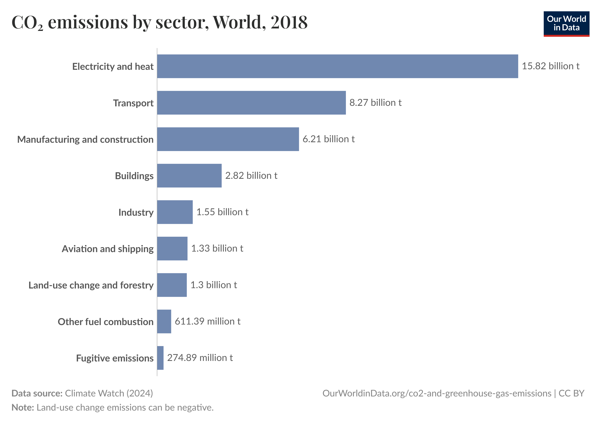

# EV Adoption vs CO₂ Intensity Dashboard  

*Testing whether EV adoption really delivers on its climate promise.*

## Executive Summary

Governments and companies are betting billions on electric vehicles as a climate solution. But the real question is: *do higher EV adoption rates actually reduce carbon emissions at a national level?*  

At first glance, EV adoption seems to align with lower emissions, but the relationship is inconsistent. For example, Norway (high EV adoption + clean electricity grid) shows steep emissions reductions, while China (high EV adoption + fossil-heavy grid) does not. Once renewable energy adoption is considered, the pattern becomes much clearer.  

The takeaway is clear: **EV adoption helps, but without a cleaner electricity grid the carbon savings are limited.**

---

## Problem Statement

Emissions from internal combustion engines (ICEs) are a major driver of climate change.

> Source: Our World in Data – *Emissions by Sector*

Transport accounts for around one-fifth of global CO₂ emissions. Three-quarters of this is from road transport.

> Source: Our World in Data - *Cars, planes, trains: where do CO₂ emissions from transport come from?*

This means that ICEs (internal combustion engines) alone are responsible for close to one-fifth of all CO₂ emissions worldwide.

Electric vehicles are often promoted as a solution to climate change, but do they actually reduce emissions at scale? This project explores whether countries with higher EV adoption also achieve lower carbon emissions per capita — and what role the energy grid plays.

---

## Methodology

Datasets to be used include:

- EV sales by country (latest years available)  
- CO₂ emissions per capita of countries (latest years available)  
- % of total electricity generated in each country per year by renewables (latest years available)  

The dashboard will present the following visuals:

- **KPI Cards:** Global EV adoption rate, Global CO₂ emissions per capita  
- **Scatter Plot:** EV adoption % (x-axis) vs CO₂ emissions per capita (y-axis), bubble size = population  
- **Line Chart:** EV adoption vs CO₂ emissions trend for selected countries (e.g., Norway, China, USA)  
- **Bar Chart:** Classification of countries based on renewable energy adoption  

---

## Tools & Skills

- **Tools:** Power BI, Excel, ChatGPT  
- **Skills:** Data cleaning, dataset merging, correlation analysis, dashboard design, data storytelling  

This project was conceptualized and executed by me, with ChatGPT used as a **research assistant** to accelerate dataset discovery and refine narrative clarity. All analysis, design choices, and conclusions are my own.

---

## Results & Key Insights

### Results (Preliminary)

The dashboard is currently in development, but based on early analysis and prior research:  

- Countries with high EV adoption and clean energy grids (e.g., Norway) show **clear reductions** in CO₂ emissions per capita.  
- Countries with rising EV adoption but fossil-heavy grids (e.g., China) show **limited reductions**, proving grid mix matters as much as EV adoption.  
- Early evidence suggests that **EV adoption alone is not enough** to guarantee lower national emissions.  

### Key Insights (Expected)

- EVs are not a silver bullet. Without decarbonizing the grid, the emissions savings are capped.  
- Policymakers and companies need to **pair EV adoption with renewable energy growth** for maximum climate impact.  
- The Philippines and other emerging markets offer an interesting case: EV penetration is low, but clean power expansion could accelerate the benefits once adoption grows.  

---

## Next Steps

A natural extension of this work would be to add the **distribution of renewable energy share by country** (e.g., solar, hydroelectric, wind) to see which sources of clean power have the most positive impact in reducing carbon emissions.  

This is not part of the current scope, but it highlights where the analysis could go in the future if deeper insights are needed.  

---

## Sources

Our World in Data – *Emissions by Sector* [https://ourworldindata.org/emissions-by-sector]  

Our World in Data - *Cars, planes, trains: where do CO₂ emissions from transport come from?* [https://ourworldindata.org/co2-emissions-from-transport]  

Our World in Data – *Share of new cars sold that are electric* [https://ourworldindata.org/grapher/electric-car-sales-share]  

Our World in Data - *CO₂ emissions per capita* [https://ourworldindata.org/grapher/co-emissions-per-capita]  

Our World in Data - *Share of electricity generated by renewables* [https://ourworldindata.org/grapher/share-electricity-renewables]  
