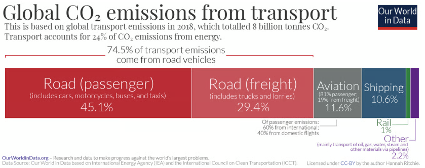
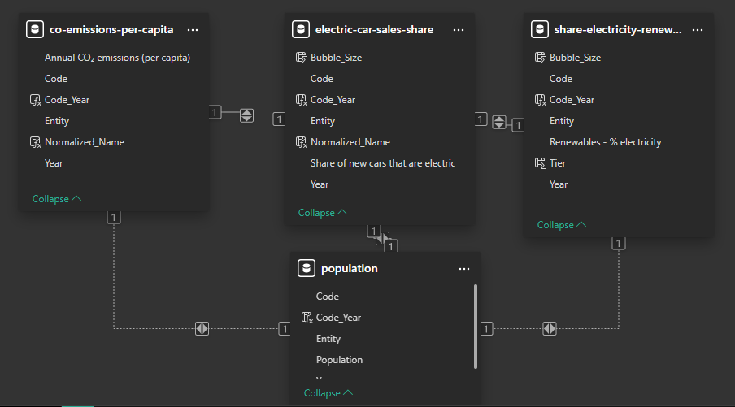
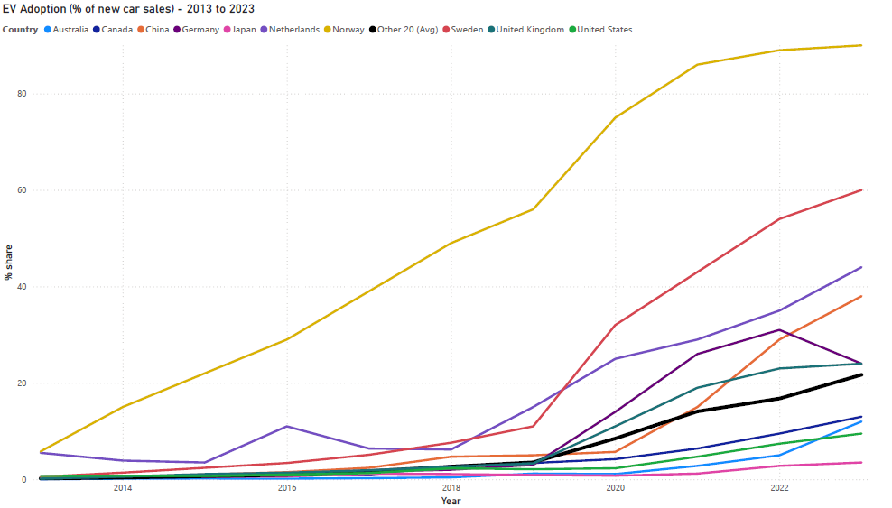
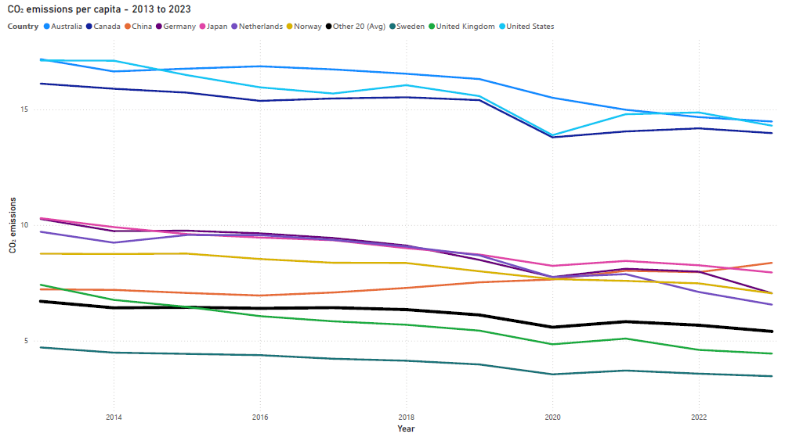
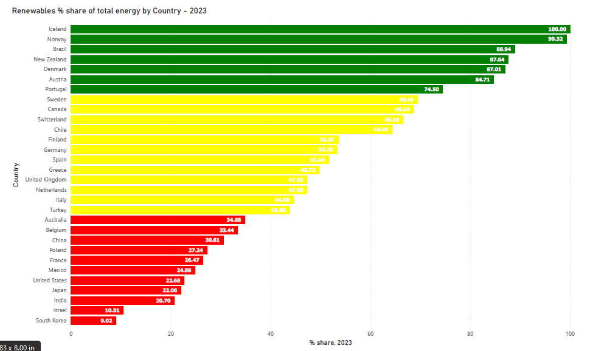

# EV Adoption vs CO₂ Emissions: A Global Dashboard

*Testing whether EV adoption really delivers on its climate promise.*

---

## Executive Summary  

Governments are investing billions in electric vehicles as a climate solution. But are EVs truly reducing emissions at scale?  

This dashboard shows that **EV adoption alone doesn’t guarantee lower CO₂ emissions**. Countries with clean electricity grids (e.g., Norway, Sweden) achieve major reductions, while fossil-heavy grids (e.g., China, US, Australia) cancel out much of the benefit.  

The takeaway is clear: **EVs only deliver on their promise when paired with clean energy grids.**  

---

## Problem Statement

Emissions from internal combustion engines (ICEs) are a major driver of climate change.

> Source: Our World in Data – *Emissions by Sector*

Transport accounts for around one-fifth of global CO₂ emissions. Three-quarters of this is from road transport.

> Source: Our World in Data - *Cars, planes, trains: where do CO₂ emissions from transport come from?*

This means that ICEs alone are responsible for close to one-fifth of all CO₂ emissions worldwide.

Electric vehicles are often promoted as a solution to climate change, but do they actually reduce emissions at scale?

I set out to explore whether countries with higher EV adoption also achieve lower carbon emissions per capita, and what role renewable energy plays in shaping the outcome.

---

## Methodology

Data sources included:

- EV sales share by country (2013–2023)  
- CO₂ emissions per capita (2013–2023)  
- Population data (2023)  
- Share of electricity generated by renewables (2013–2023)  

### Decluttering Steps

The project combines four datasets. To keep the analysis clear:

- **Step 1:** I focused on **10 Anchor countries** (Australia, Canada, China, Germany, Japan, Netherlands, Norway, Sweden, United Kingdom, United States) while grouping the **Other 20** as background context.

- **Step 2:** I refined scatter plot visuals so anchors scale with **true population**, while the Other 20 appear as smaller dots. This way, all 30 countries stay visible, but anchors drive the narrative.  

### Renewable Energy Tiering

I classified countries into three tiers based on renewable energy share:  

- **Tier 1 (70–100%)** – Clean grids i.e. high renewables  
- **Tier 2 (40–70%)** – Mixed grids  
- **Tier 3 (<40%)** – Fossil-heavy grids  

This tiering provides a simple, transparent way to compare EV adoption against emissions outcomes across grids with very different levels of renewable penetration.

*Note: The thresholds (70%, 40%) were chosen as intuitive cutoffs to group countries into high, medium, and low renewable adoption. These breakpoints are not absolute, but they simplify comparison and align with how energy analysts often frame renewable penetration levels.*

---

## Tools & Skills

- **Tools:** Power BI, Excel, ChatGPT (as research/narrative accelerator)  
- **Skills:** Data cleaning, dataset merging, correlation analysis, dashboard design, and data storytelling  

I conceptualized and executed this project, with ChatGPT used as a **research assistant** for brainstorming, to accelerate dataset discovery and refine narrative clarity. All analysis, design choices, and conclusions are my own.

---

## Results & Key Insights

### 1. EV Adoption Trends

*Punchline: EV adoption is accelerating worldwide.*  
EV sales share has steadily risen since 2013, led by Norway (90% in 2023).  

---

### 2. CO₂ Emissions Trends  

*Punchline: Emissions are falling, but unevenly.*  
CO₂ per capita has generally decreased, with Sweden among the lowest at 3.46 tonnes/person in 2023.  

---

### 3. EV Adoption vs CO₂ (Initial Scatter)  

*Punchline: The relationship between EV adoption and CO₂ emissions is unclear.*  
I charted EV adoption vs CO₂ emissions per capita to try to find a correlation between the two.

Three of the anchors (Australia, Canada, United States) clustered at the top left, corresponding to low EV adoption/high CO₂ emissions.  There are also a few dots, including 2 of the anchors (Norway and Sweden) on the bottom right, corresponding to high EV adoption/low CO₂ emissions.  Given the premise that higher EV adoption leads to lower CO₂ emissions, these findings are expected.

It is a bit surprising to find a cluster of dots at the lower left (low EV adoption/low CO₂ emissions), Iceland close to the upper right (high EV adoption/high CO₂ emissions) and China right in the middle.  Even with relatively high EV adoption, its CO₂ emissions are still above average.

Overall, the chart looks messy and difficult to explain.  There doesn't seem to be a clear correlation between EV adoption and CO₂ emissions.  EV adoption trends aren’t enough to explain the picture.

To really understand emissions, there seems to be a missing piece — *and I think it is the energy grid*.

---

### 4. Renewables vs CO₂

*Punchline: Renewables reveal a pattern.*  

I charted the renewable energy share of the total energy produced vs. CO₂ emissions, in the same 30 countries as above.

Most countries gravitate toward the lower-right (high renewable share, low CO₂). This suggest that greater renewable energy adoption generally leads to lower emissions.  

---

### 5. Renewable Energy Tiers

*Punchline: Countries fall cleanly into three groups.*
Countries can be grouped into three tiers based on renewable energy share: Tier 1 (70–100%) = clean grids, Tier 2 (40–70%) = mixed grids, and Tier 3 (<40%) = fossil-heavy grids.

This tiering system helps to compare EV adoption and CO₂ emissions on a more level playing field.

---

### 6. EV Adoption vs CO₂ (Tiered Scatter)  

*Punchline: The messy chart finally makes sense.*  
After I integrated the tiers to the initial scatter plot, the chart finally made sense.

- **Tier 1 (green):** High EV adoption leads to low emissions  
- **Tier 2 (yellow):** Mixed outcomes  
- **Tier 3 (red):** High emissions regardless of EV adoption  

The conclusion: **EV adoption only works when paired with clean grids.**

---

## Outliers

**Iceland** appears as an exception: nearly 100% renewable electricity but very high per capita CO₂ emissions. This is explained by Iceland’s small population and energy-intensive industries (e.g., aluminum smelting). When emissions are divided across a tiny population, per-capita values get distorted.  

> Source: OECD - *OECD Economic Surveys: Iceland 2025*

This highlights that **industrial structure matters too**, not just EVs and renewables.

**Brazil** is in Tier 1 because ~ 89% of its electricity generation is renewable (hydro, biomass, wind, solar) according to multiple sources. However, its EV adoption remains quite low relative to other Tier 1 countries, so in the scatter it shows up with high renewables + still low EV share.

> Source: Global Energy - *Brazil becomes G20 leader in terms of renewables share in energy mix*

**Sweden** sits at ~69.5% renewables, just shy of the Tier 1 cutoff (70%).  While it technically falls into Tier 2 under my classification, its **low CO₂ emissions** show it behaves more like a Tier 1 country.  I kept it in Tier 2 for consistency, but this highlights that **thresholds are simplifications** — some countries (like Sweden) can straddle categories depending on where you draw the line.  

---

## Conclusion  

Electric vehicles are **not a silver bullet** for reducing CO₂ emissions.  The data shows that EV adoption only delivers significant emission reductions when paired with a **clean electricity grid**.  

For policymakers, the implication is clear: focus not only on accelerating EV adoption but also on **decarbonizing the grid**. Renewable energy is one path, but it’s not the only one. Countries like France demonstrate that **nuclear power** can also provide a low-carbon backbone.  

## Next Steps  

This analysis highlights the big picture, but it also opens the door for deeper exploration. A natural extension would be to break down renewables by source (solar, wind, hydro) to see which contribute most to emission reductions. While outside the scope of this dashboard, such analysis could guide **country-specific policy choices** on where to invest for maximum impact.  

---

## Sources

Our World in Data – *Emissions by Sector* [https://ourworldindata.org/emissions-by-sector]  

Our World in Data - *Cars, planes, trains: where do CO₂ emissions from transport come from?* [https://ourworldindata.org/co2-emissions-from-transport]  

Our World in Data – *Share of new cars sold that are electric* [https://ourworldindata.org/grapher/electric-car-sales-share]  

Our World in Data - *CO₂ emissions per capita* [https://ourworldindata.org/grapher/co-emissions-per-capita]  

Our World in Data - *Share of electricity generated by renewables* [https://ourworldindata.org/grapher/share-electricity-renewables]  

Our World in Data - *Population* [https://ourworldindata.org/grapher/population]

OECD - *OECD Economic Surveys: Iceland 2025* [https://www.oecd.org/en/publications/oecd-economic-surveys-iceland-2025_890dbe05-en.html]

Global Energy - *Brazil becomes G20 leader in terms of renewables share in energy mix* [https://globalenergyprize.org/en/2024/07/19/brazil-becomes-g20-leader-in-terms-of-renewables-share-in-energy-mix/]
